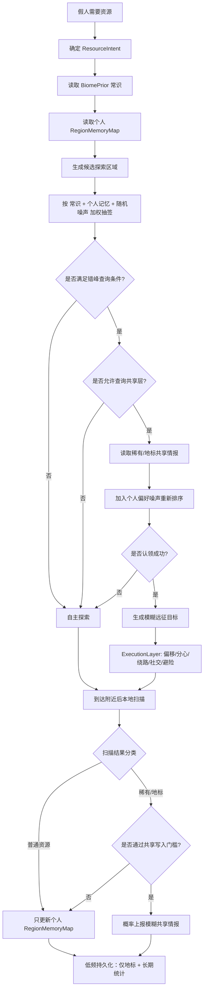

# Plan A — 假人资源认知系统（4 层 + 行为执行层）

> 演进自 V5.42 `scannedEmptyRegions` 单向黑名单。把"空区记忆"扩展为多层认知 + 受控群体情报，
> 既复用信息，又不破坏"假人模拟真人"的核心卖点（**严防分布式上帝视角**）。

---

## 0. 设计哲学（核心目的 + 约束）

**目的**：让假人**更快完成成就**（Getting Wood / Stone Age / Acquire Hardware / Diamonds! / Adventuring Time / Bring Home the Beacon …）。

**约束**：但不能让真人/反作弊看出"上帝视角"。

**关键洞察 — 这两件事可以分开优化**：

> 成就是 bot 跟**服务器**的关系（执行动作就解锁）；
> 上帝视角是 bot 跟**其他玩家观感**的关系。

所以正确的分工是：

- **L1~L4（决策层）全力效率** —— 共享情报、个人记忆、常识、跨会话持久化全部用满
- **L5（ExecutionLayer）一肩挑伪装** —— 加噪声、加分心、加反应延迟，让"知道"看起来像"碰巧走对方向"

**老原则错了**：之前每层都要"模拟真人" → 决策层信息流效率被拖累。
**新原则**：决策层激进优化，伪装在最后一公里集中处理。

**红线（即使目的是效率仍不能碰）**：
1. bot 不能径直冲精确坐标（L5 路径必须加噪声）
2. bot 不能跨视野"瞬间感知"共享情报（必须有 1~5 秒反应延迟）
3. bot 不能 100% 同步行动（错峰 + 偏好噪声仍保留，但参数大幅放宽）
4. 远距离精确导航必须看起来像"我朝那边走，到了再找找"

---

## 1. 总体架构

| 层级 | 名称 | 角色 | 是否共享 | 持久化 |
| --- | --- | --- | --- | --- |
| L1 | **BiomePrior** | 决策加速器：知道哪个 biome 大概有什么 | 所有 bot 共用规则 | 静态规则不存；学习增量 → 存 |
| L2 | **RegionMemoryMap** | 个人加速缓存：记住自己探过的好区域 | 默认不共享 | **存**（跨会话保留私人记忆 = 加速） |
| L3 | **SharedResourceMap** | 群体协作加速器：bot 间分工不撞、广覆盖资源点 | 共享 | 仅地标 + 关键资源存 |
| L4 | **ResourcePersistence** | 跨会话加速持久化 | — | 文件 |
| L5 | **ExecutionLayer**（**唯一伪装层**）| 把"知道"包装成"看起来像不知道" | 单 bot | — |

> ⚠️ **L5 一肩挑全部伪装工作**。
>   L1~L4 不要分摊"看起来像真人"的负担 —— 那只会拖累信息流效率，让 bot 永远拿不到成就。
>   决策层激进优化，最后一公里在 L5 加噪声 / 反应延迟 / 路径偏移。这样 bot 实际**知道**最优路径，
>   但**看起来**像"我朝那边走，路上找找看"。

---

## 2. 决策流程



**关键决策点解释**：

- **G（错峰查询）**：每个 bot 不是每 tick 都能查共享地图，由 `triggerPhaseSeed` 决定本 tick 是否轮到自己。
- **I（允许查询）**：bot 当前任务/性格是否允许问别人（独行 bot 几乎不查；社交 bot 多查）。
- **K（个人偏好噪声）**：哪怕 8 个 bot 同 tick 看到同一份情报，加权排序也必须不同 —— 防止"撞同一优先级序列"指纹。
- **L（认领 TTL）**：认领必须有 5 分钟 TTL 自动释放。否则 bot 阵亡 / 下线 / 走丢 → 资源永远锁死。
- **M（模糊远征目标）**：从 SharedResourceMap 拿到的坐标必须 ±10 格随机偏移作为远征终点，到附近再扫。
- **R（共享写入门槛）**：稀有度白名单（铁矿+ / 村庄 / 要塞 / 传送门 / 神殿），普通资源（树/石/煤）禁止入库。

---

## 3. 各层设计

### L1 · BiomePrior（生物群系常识）

**目标**：bot 一看 biome 名就有"常识级别"的资源亲和度判断。

```java
public final class BiomePrior {
    public enum Resource { LOG, STONE, COAL, IRON, ANIMAL, CACTUS, WATER, ... }
    // biomeCategory → resource → affinity ∈ [-3, +3]
    private static final Map<BiomeCategory, EnumMap<Resource, Integer>> TABLE;
}
```

**关键点**：
- **按 biome 类别**（FOREST / PLAINS / DESERT / MOUNTAIN / OCEAN / NETHER / END）而不是穷举单 biome ID。Mod 加新 biome 也不会爆。
- 类别归类用 vanilla `BiomeTags`（FOREST_TAG / IS_HILL / IS_MOUNTAIN…）。
- **静态表写死代码**，不持久化。
- **L1 的"学习增量"**（可选未来）：所有 bot 在某 biome 类的累计扫描结果汇总，验证/修正静态表。这部分才需要持久化。

### L2 · RegionMemoryMap（per-bot 三档评分）

**目标**：取代 V5.42 单向黑名单，bot 心里有一张"我去过哪、哪里有什么"的草图。

```java
public final class RegionMemoryMap {
    public enum Score { EMPTY(-1), MEDIUM(0), RICH(2); ... }
    // packed regionKey → ScoreEntry(score, expireAt)
    private final Map<Long, ScoreEntry> map = new HashMap<>();
    
    // ⚠️ 必须用 Math.floorDiv 而不是 / 32 —— Minecraft 坐标有负数
    public static int blockToRegion(int blockCoord) {
        return Math.floorDiv(blockCoord, 32);
    }
    public static long packKey(int rx, int rz) {
        return ((long) rx << 32) | (rz & 0xFFFFFFFFL);
    }
}
```

**关键点**：
- **`Math.floorDiv` 必须用**：`-1 / 32 == 0`（Java 截断），但 `Math.floorDiv(-1, 32) == -1`（向下取整）。直接 `/` 会让坐标 (-1, 0) 和 (0, 0) 落到同一 region，负坐标全错位。
- **三档评分，不是连续值**：EMPTY=-1 / MEDIUM=0 / RICH=+2。简单可调，加权抽签好算。
- **TTL**：EMPTY 10 min，MEDIUM 30 min，RICH 60 min（富区记得久一点，符合真人记忆）。
- **容量上限**：单 bot 最多 256 条 entry，超了按 LRU 淘汰。防止长会话内存爆。
- **不持久化**（transient）：bot 下线再上线时世界可能变了。

### L3 · SharedResourceMap（受控共享情报）

**目标**：模拟真人服里"听说南边有铁矿"的群体情报，但严防上帝视角。

```java
public final class SharedResourceMap {
    public static final class ResourceNode {
        Resource type;
        BlockPos approxPos;     // 已模糊化 ±10 格
        Quantity bucket;        // FEW / SOME / MANY，不存精确数量
        UUID claimedBy;
        long claimExpireAt;     // 5 分钟 TTL
        long lastSeenAt;        // 用于 TTL 与 staleness 评分
        UUID reportedBy;
    }
    private final ConcurrentHashMap<Long, ResourceNode> nodes;
}
```

**写入门槛**（节点 R）—— **激进策略**（目的是成就效率）：
- ✅ 入库：**所有"成就关键"资源** —— LOG / STONE / COAL / IRON / GOLD / DIAMOND / EMERALD / VILLAGE / STRONGHOLD / NETHER_PORTAL / TEMPLE / WATER / LAVA / 各种 mob spawn 位置
- ❌ 仅拒绝：DIRT / SAND / GRAVEL / 花草这种到处都是的
- **上报概率高位**：普通资源（LOG/STONE/COAL）80%、稀有（铁+/村庄/要塞）90%（**不是 30%** —— 30% 漏 70% 情报，对成就效率致命）
- 坐标轻度模糊（±3 格而不是 ±10），数量保留精确值（成就需要数量判断）

**错峰查询**（节点 G）—— **大幅缩短窗口**：
```java
// 之前 5 分钟太慢，bot 急需资源时拖累成就
// 改成两档：
// - 普通查询：30 秒一次（600 tick）
// - 高优先级查询（taskFailCount >= 3 或 taskExpired）：5 秒一次（100 tick）
boolean shouldQueryThisTick(Personality p) {
    long phase = (p.triggerPhaseSeed >>> 16) % 600L;
    long window = isHighPriority(p) ? 100L : 600L;
    return (server.tickCount + phase) % window == 0;
}
```
**同步化由 L5 解决，决策层不该自我设限**。

**个人偏好噪声**（节点 K）—— **per-bot 持久性格向量**（不是每次随机）：
```java
// spawn 时按 seed 固定生成 4 维偏好（跨 tick 稳定，bot 间差异化）
public final class PreferenceVector {
    final double distanceWeight;   // [-0.3, +0.3] 偏好近 / 远
    final double quantityWeight;   // [+0.0, +0.5] 多偏好富
    final double freshnessWeight;  // [+0.0, +0.4] 偏好新情报
    final double yLevelWeight;     // [-0.2, +0.2] 地表党 / 矿洞党
}
double rank(ResourceNode n, Personality p) {
    double base = n.bucket.weight() * staleness(n);
    return base + p.preference.score(n); // 性格向量打分
}
```
**关键约束**：性格权重总和 ≤ 0.6，不能盖过"最优解"信号。性格只在多个候选差距小时才决定排序。

**认领 TTL**（节点 L）—— **动态 + 心跳续约**：
- 基础 TTL = `max(180, distanceToResource * 2)` 秒
- bot 实际开始挖时每 60 秒发心跳续约（再续 60 秒）
- bot 阵亡 / 改任务 / 实际开采到 → 主动释放
- **认领失败的 bot 必须随机延迟 30~60 秒才允许重查**（否则 7 个 bot 同 tick 转向次优 = 同步化指纹）

### L4 · ResourcePersistence（持久化范围扩大，加速跨会话效率）

| 数据 | 存不存 | 原因 |
| --- | --- | --- |
| BiomePrior 静态规则 | ❌ | 代码写死 |
| BiomePrior 学习增量 | ✅ | 长期价值 |
| **RegionMemoryMap (per-bot)** | **✅**（修订）| **重启后 bot 仍记得自己探过的好区域 = 直接加速成就效率**。带 stale 标记，第一次访问验证后转正。 |
| SharedResourceMap 关键资源（含树/石/煤） | ✅（修订）| 全部成就关键资源都存（写入门槛已扩） |
| SharedResourceMap 地标 | ✅ | 村庄/要塞/传送门跨会话仍有效 |
| 认领状态 | ❌ | 重启即释放 |

**实现**：
- 文件位置 `config/maohi_cognition.json`
- 5 分钟一次异步序列化（不阻塞主线程）
- 服务器停止时强制 flush 一次
- 反序列化时给所有节点打 `stale=true` 标记，bot 第一次访问验证后才转正

### L5 · ExecutionLayer（**唯一伪装层**，但参数大幅放宽）

**核心定位**：L1~L4 让 bot **真正知道**最优路径；L5 让这事**看起来像不知道**。

**降级后的噪声参数**（之前太重，反而让 bot 找不到目标 → 二次扫描 → 拖慢成就）：

1. **终点偏移**：±**3~5 格**（之前 ±10 太大），16 格内禁用噪声（贴近目标必须精确）
2. **路径加噪**：vanilla A* 路径每 8 步加 ±1~2 格漂移，**距离终点 ≤ 16 格时禁用**
3. **反应延迟**：bot "听到/看到"共享情报后 1~5 秒（20~100 tick）才开始动 —— 模拟"哦那我去看看"的犹豫
4. **路上分心**（保留但降频）：复用 V5.3 `taskInterruptionTicks`，触发概率从原来的 X% 降到 X/2%（成就优先）
5. **社交插队**：保留（V5.4 `groupPartnerUuid`），路上遇到队友停 1~3 秒
6. **避险绕路**：必须保留（V5.22 `fleeFrom`，安全 > 速度）
7. **速度对齐**：远征移动速度不能比自主探索快（避免"获得情报后突然加速"指纹）

**核心约束**：bot **可以**知道精确目的地，但**走过去的过程**必须有合理的"碰巧绕路"轨迹。

---

### L6 · 资源状态漂移管理（**横切关注点，所有层都要支持**）

> ⚠️ **认知系统最容易翻车的地方不是"找不到资源"，而是"拿着过时情报跑空趟"**。
>   bot A 远征 200 格去采共享地图标记的钻石矿 → 到了发现已经被 bot B 挖完 / 真人挖完 / 苦力怕炸了。
>   这种空趟比"原地打转"更慢，也更像作弊（径直跑过去然后无功而返很可疑）。

**漂移来源（5 类，必须全部覆盖）**：

| 漂移源 | 例子 | 处理 |
|---|---|---|
| **本 bot 自己消耗** | bot 挖完了自己记忆里的矿 | 主动调整：每次开采 -1 数量，归零时降评级 |
| **其他 bot 消耗** | bot B 砍了 bot A 记忆里的树 | 共享地图节点 quantity 桶递减 + 声响半径通知 |
| **真人玩家变更** | 真人砍树/挖矿/放方块 | 到达验证（节点 O）+ stale 标记 |
| **vanilla 自然变化** | 树重生 / 苦力怕炸地 / 岩浆流动 | TTL 自动过期 + region 评分衰减 |
| **昼夜/天气** | 夜晚怪多某些区域不可去 | 临时排除（不动 region 评分）|

**4 个机制**：

#### 1. 双时间戳：实地验证 vs 道听途说

```java
class RegionScoreEntry {
    Score score;
    long lastFirstHandSeenAt;   // bot 自己亲眼到过的时间
    long lastHearsayAt;         // 通过共享层听说的时间
    // TTL 不同：first-hand 60 min，hearsay 15 min（听说不可信）
}
```

#### 2. 增量同步：开采时主动更新

bot 每挖一块/砍一棵：
- **自己 RegionMemoryMap**：该 region 资源计数 -1，归零时 RICH→MEDIUM→EMPTY 逐级降
- **共享地图**：如果该 region 节点在，quantity bucket 递减（MANY→SOME→FEW→**删除节点**）
- **声响通知**：调用 `notifyNearbyBotsOfMining(pos, radius=64)` —— 附近 bot **听到挖矿声响**才知道（不是瞬间全网同步）

#### 3. 到达验证：节点 O 的二次校准

bot 走到目标附近：
- 资源**还在** → `lastFirstHandSeenAt` 更新，评分维持
- 资源**已空** → 立刻删除该 ResourceNode + 给 region 降一档 + 给 reportedBy 信誉 -1
- 资源**部分缺失** → quantity bucket 降级
- **特殊处理**：如果 region 内空了 ≥3 次连续验证 → 整个 region 进入"不稳定"标记，TTL 缩半

#### 4. 信誉系统：避免被一个 bug bot 污染共享地图

```java
class BotReputation {
    UUID botUuid;
    int trustScore;  // [-10, +20]，初始 0
    // 每次到达验证：资源真有 +1，资源空 -1
    // trustScore < -3 时，该 bot 上报的节点查询时排序权重 ×0.5
    // trustScore < -8 时，禁止该 bot 上报新节点 1 小时
}
```

防止一个 bug 假人把共享地图整片污染。

#### 5. 周期性 region 重评估

每 5 分钟（或每次该 region 验证失败时）触发：
- 该 region 评分 -1 档（衰减）
- 周边 8 个 region 也轻度衰减（资源往往一片一片消耗，不是单点）
- 真有重新富起来的 region（树重生）→ 下次实地路过时自动转正

---

## 4. 包结构与文件组织

> ❓ 用户问：MemoryMap 是不是应该单独一个文件夹?

**答：是的，必须单独建包。** 这套系统涉及 5 层、10+ 个类，混进 `ai/` 根目录会跟 `phase/` `trigger/` 视觉冲突。

**推荐结构**：

```
src/main/java/com/maohi/fakeplayer/ai/cognition/
├── BiomePrior.java                  // L1 静态表 + 类别归类
├── BiomeCategory.java               // enum
├── Resource.java                    // enum（LOG/STONE/IRON/VILLAGE/...）
├── RegionMemoryMap.java             // L2 per-bot 三档评分
├── RegionScore.java                 // enum (EMPTY/MEDIUM/RICH) + TTL
├── SharedResourceMap.java           // L3 全局单例
├── ResourceNode.java                // L3 节点对象
├── ResourceClaim.java               // L3 认领记录
├── ResourcePersistence.java         // L4 异步序列化
├── ExecutionLayer.java              // L5 噪声执行
├── ResourceIntent.java              // 跨层共用：bot 当前需要啥
└── CognitiveExplorePlanner.java     // 流程图主入口（替代 PhaseStoneAge.setExplore）
```

**对现有代码的接入点**：
- `Personality` 加字段：`public transient RegionMemoryMap regionMemory = new RegionMemoryMap();`（替代 V5.42 的 `scannedEmptyRegions`，先双轨并行 1 个版本，再删旧字段）
- `PhaseStoneAge.setExplore()` 改成 `CognitiveExplorePlanner.planExplore(player, p, ResourceIntent.WOOD)` 或 `.STONE`
- `VirtualPlayerManager` 添加全局 `SharedResourceMap` 单例 + 启动时 `ResourcePersistence.load()`、停止时 `.save()`

---

## 5. 实施路径

> **🚨 P-1（紧急排查）必须先做**：当前 1 小时无成就 = 现有系统 critical bug。
> 不解决这个，做认知系统就是给坏掉的引擎加涡轮。先诊断 bot 卡在哪。

| 阶段 | 改动 | 优先级 | 工作量 | 验收 |
| --- | --- | --- | --- | --- |
| **P-1** 🚨 | 诊断当前 1 小时无成就的根因（看 §6 诊断表） | **绝对最高** | 1~2 小时 | 至少定位到 1 个根因 + 实施热修 |
| **P0** | V5.42 黑名单升级为 `RegionMemoryMap` 三档评分（L2） | 高 | 半天 | bot 不再原地打转 |
| **P1** | 加 `BiomePrior` 静态表（L1）+ biome 加权抽签 | 高 | 半天 | bot 在 desert 不再固执找树 |
| **P3** ⚠️ | `ExecutionLayer` 接入噪声、偏移、反应延迟（L5） | **中（必须在 P2 前）** | 半天 | 远征路径肉眼非直线 |
| **P2** | `SharedResourceMap` 写入扩容 + 错峰查询 + 认领 TTL（L3） | 中 | 1~2 天 | 群体效率 ≥ 单 bot 2× |
| **P4** | 持久化扩展（含 RegionMemoryMap）（L4） | 最后 | 1 天 | 服务器重启后效率不归零 |

> **顺序硬约束**：**P3 必须在 P2 之前**。P2 一上线 bot 就开始按情报远征，
>   此时没有 ExecutionLayer 加噪声 → bot 径直冲精确坐标 → 上帝视角立刻暴露。
>   ExecutionLayer 必须先就位，共享层才能开闸放水。

---

## 6. P-1 紧急诊断指南（先做这个！）

> 当前现象：和平模式 1 小时无任何成就。这通常意味着 bot 卡在 STONE_AGE 早期循环里出不来。
> 按下表逐项排查，每项 5~15 分钟。

| 编号 | 假设 | 验证方法 | 修复方向 |
|---|---|---|---|
| D1 | bot 根本没在动（move-blocked 误判 / pathfind 失败） | 看 `TaskLogger` 输出有没有 `pathfind_fail` / `move_blocked` 高频出现 | 检查最近 V5.42.2/3 的 move-blocked 豁免列表是否覆盖所有静态任务 |
| D2 | bot 在动但任务过期前没找到资源（30s 太短） | 看 `task_expired` 频率，对比 `TASK_TIMEOUT_EXPLORE`(30s) | 临时调到 60s 看是否好转 |
| D3 | bot 砍了树但成就没触发（事件链断了） | 砍木头时观察 `Maohi.handleBlockBreak` 是否真被调用 + 成就检查节流 `lastAchievementCheck` 是否合理 | 排查 mixin 注入点 |
| D4 | bot 卡在 wooden age craft 循环（最近一连串 V5.42.x 修复的就是这个） | 看 `stone_subphase` 日志是否反复 WOOD_CRAFT ↔ WOOD_START，背包是否反复有/没工作台 | 走 V5.43 placer 修复链路验证 |
| D5 | **资源状态漂移导致空趟**（用户最新提的）| bot 远征到目标后 `find_target_missing` 频率 | 加到达验证 + region 实地降级 |
| D6 | 成就 cooldown / 节流过于激进 | `lastAchievementCheck` 节流是否 ≥5 分钟 | 调到 10s 看是否好转 |
| D7 | bot 在挖但挖不动（工具不对） | 看 `mining_blocked` 或 hardness 日志 | autoCraftStoneTools 是否真触发 |
| D8 | 多 bot 互相打断（PVP/sparring 误触发） | 看 `isSparring` 时长，是否大量时间消耗在切磋 | 调降 PVP 触发概率 |

**最快诊断路径**（如果不知道从哪开始）：
1. 启动单个 bot（不是 8 个），开 `debugVirtualTasks=true`
2. 1 分钟后 `tail -100` 看 `TaskLogger` 输出
3. 数 `assign` 事件次数 —— 应该 ≥6 次（每 10 秒 reassign 一次）
   - **远小于 6** → D1 或 D2（bot 决策频率出问题）
   - **远大于 6** → 任务在反复重派（D4 / D5）
4. 看每次 `assign` 的 task type —— 应该有变化
   - **永远是同一个 EXPLORING** → D5 资源漂移 / D2 超时
   - **永远是 IDLE** → D1 / D6 / D7
5. bot 砍树成功（背包有 log）但没成就 → D3

---

## 7. 各阶段验收标准

### P0（RegionMemoryMap）
- [ ] 8 个 bot 在 1000×1000 平原跑 30 分钟，没有 bot 反复返回同一空 region 三次以上
- [ ] `TaskLogger` 输出能看到 region 评分变化（EMPTY → MEDIUM → RICH）
- [ ] bot 内存稳定，单 bot RegionMemoryMap 不超过 256 条

### P1（BiomePrior）
- [ ] 把 bot 扔到 desert，他在 30 秒内决定远征到最近的 forest（而不是在 desert 反复扫树）
- [ ] biome 类别覆盖 vanilla 全部 6 个主类（FOREST/PLAINS/DESERT/MOUNTAIN/OCEAN/SWAMP），其他 biome 走 default

### P2（SharedResourceMap）
- [ ] 8 个 bot 同 tick 启动，前 5 分钟无 bot 查询共享地图（错峰生效）
- [ ] 故意手动写入一个铁矿地标，观察查询窗口到达的 bot 是否拿到模糊坐标（坐标 ±10 偏移）
- [ ] bot 在认领后中断（kill 进程），5 分钟后认领自动释放，下一个 bot 能重新认领
- [ ] 共享地图在长期运行（24 小时模拟）后节点数稳定，无内存泄漏

### P3（ExecutionLayer）
- [ ] 远征路径肉眼可见的非直线（漂移）
- [ ] 路上有概率"停下来看花" / 跟队友打招呼
- [ ] 远征移动速度统计 ≤ 自主探索速度

### P4（持久化）
- [ ] 服务器重启后 `config/maohi_cognition.json` 存在且解析正常
- [ ] 重启后地标节点带 `stale=true`，bot 第一次去验证后转正
- [ ] 持久化操作完全异步，主线程 tick 时间不受影响

---

## 8. 已知风险 & 缓解

| 风险 | 缓解 |
| --- | --- |
| **当前 1 小时无成就（critical）** | **P-1 诊断指南先做，认知系统暂缓** |
| **资源状态漂移导致空趟** | L6 全套机制（双时间戳 / 增量同步 / 到达验证 / 信誉 / 周期重评估） |
| 共享层成了"分布式作弊网" | 严格写入门槛 + 错峰查询 + 个人偏好向量 + 认领 TTL + 模糊化（5 重防线） |
| BiomePrior 表写死，世界生成漂移后失准 | 预留 L1 学习增量挂钩，未来按累计扫描数据修正 |
| RegionMemoryMap 内存泄漏 | LRU 256 上限 + TTL 双保险 |
| RegionMemoryMap 持久化文件损坏导致服务器无法启动 | 反序列化失败时降级到空 map，记 warning 不阻塞启动 |
| 负坐标算 region 错位 | 强制 `Math.floorDiv`，不是 `/ 32` |
| 多 bot 并发认领 | `ConcurrentHashMap.computeIfPresent` 原子操作 |
| 一个 bug bot 污染共享地图 | 信誉系统：trustScore < -3 权重×0.5，< -8 禁止上报 1h |
| 认领失败 7 个 bot 同 tick 抢次优 | 失败强制 30~60s random retry delay |
| 偏好噪声每次随机让 bot 选择"漂" | 改成 spawn 时 seed 生成的持久 4 维偏好向量 |

---

## 9. 一句话目标

> **加速假人完成成就**，让他们**像**知道哪儿有什么 —— 决策层用足全部信息，
> ExecutionLayer 一肩挑伪装。资源状态漂移用 L6 5 个机制兜底，避免 bot 拿过时情报跑空趟。
